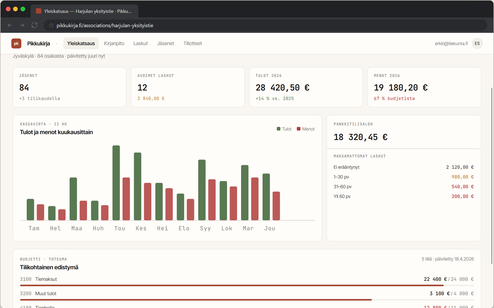
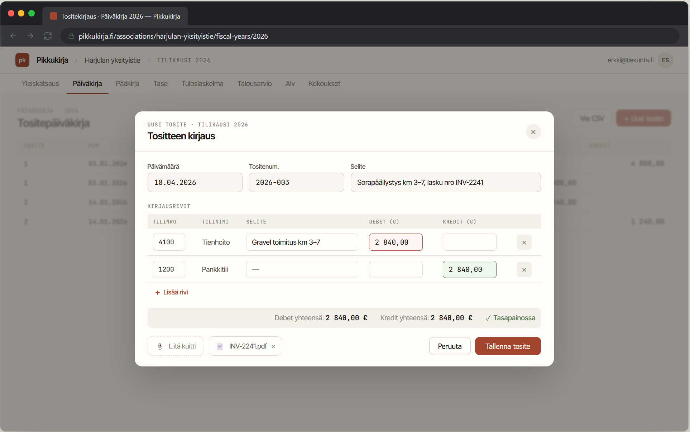
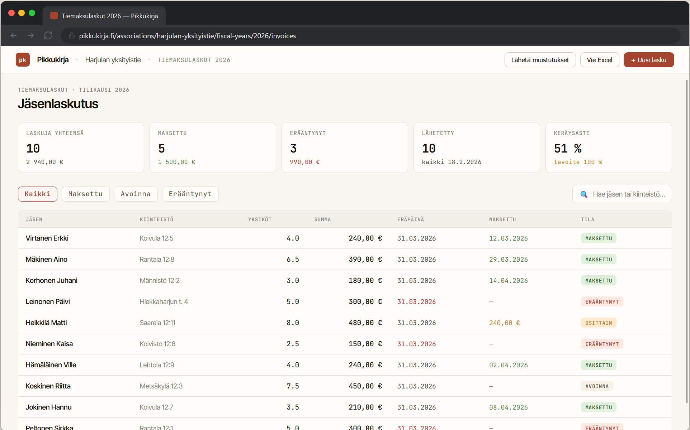

<p align="center">
  
</p>

<h1 align="center">Pikkukirja</h1>

<p align="center">
  <strong>Accounting software for small associations and communities</strong><br/>
  Web-based &middot; Self-hosted &middot; Single-file SQLite database
</p>

<p align="center">
  
  
  
  = 22" />
</p>

<p align="center"><a href="README.md">🇫🇮 Suomeksi</a></p>

---



---

> **Note:** The application UI is currently in Finnish only.

---

## Why Pikkukirja?

Small associations don't need heavyweight accounting software. Pikkukirja is a lightweight, browser-based application that runs on an affordable VPS. All data lives in a single SQLite file — easy to back up, move, and archive.

---

## Supported organisation types

| Type | Description | Billing basis |
|------|-------------|---------------|
| **Road cooperative** (Tiekunta) | Private road maintenance associations | Road units |
| **Hunting club** (Metsästysseura) | Hunting associations | Fixed membership fee by member type |
| **Housing company** (Taloyhtiö) | Small housing companies | Share count (maintenance charge) |
| **Sole trader** (Toiminimi) | Self-employed individuals | Free invoicing + VAT tracking |

Each organisation type comes with its own chart of accounts, invoice accounts, and default annual report headings.

---

## Features

```
┌─────────────────────────────────────────────────────────────────┐
│                        PIKKUKIRJA                               │
├──────────┬──────────┬──────────┬──────────┬─────────────────────┤
│ Account- │ Member   │ Invoice  │ Reports  │    Admin            │
│ ing      │ registry │ ing      │ & PDF    │                     │
├──────────┼──────────┼──────────┼──────────┼─────────────────────┤
│ Vouchers │ Contact  │ PDF      │ Income   │ User roles          │
│ Chart of │ details  │ invoices │ statement│ (admin/user/viewer) │
│ accounts │ Reference│ Email    │ Balance  │ SMTP settings       │
│ Attach-  │ numbers  │ sending  │ sheet    │ Audit log           │
│ ments    │ CSV      │ Payment  │ Journal  │ Backups             │
│ Templates│ import   │ remind-  │ Ledger   │ Cron scheduling     │
│ CSV      │          │ ers      │ Annual   │ Dark/light theme    │
│ export   │          │ Bank     │ meeting  │                     │
│ Recon-   │          │ import   │ Minutes  │                     │
│ ciliation│          │          │          │                     │
├──────────┴──────────┴──────────┴──────────┴─────────────────────┤
│  Bank statements  │  Budgeting  │  VAT tracking  │  Meetings    │
└───────────────────┴─────────────┴────────────────┴──────────────┘
```

### Accounting



- Double-entry bookkeeping with vouchers
- **Voucher copying** — copy an existing voucher as the basis for a new one
- **Attachments** — receipt or document (PDF, JPEG, PNG, GIF, WebP, max 10 MB) per voucher; paperclip icon shown in the journal
- **Attachment archive** — organisation-level overview of all attachments; search by name or filter unattached
- **Voucher templates** — save recurring entries as templates (monthly, quarterly, yearly); use from a quick-pick menu
- **Duplicate detection** — warning if a similar voucher (±3 days, same amount, similar description) already exists
- **Journal search** — filter by description, voucher number, account number, or account name
- **CSV export** — vouchers with lines as a CSV file (Excel-compatible, UTF-8 BOM)
- Chart of accounts management (income, expense, and balance accounts)
- Real-time debit/credit reconciliation
- Warning on unusual postings (e.g. debit to an income account)

### Fiscal year management

- Multiple fiscal years per organisation
- Year-end closing: zeroing income/expense accounts to profit/loss account
- Opening a new fiscal year: balance sheet carried forward as an opening voucher — confirmation dialog prevents accidental openings
- Vouchers in a closed fiscal year are shown in read-only mode

### Member and customer registry

- Contact details (name, address, email)
- Organisation-type-specific fields:
  - **Road cooperative** — properties and road units
  - **Hunting club** — member type (full, probationary, youth, honorary)
  - **Housing company** — apartments and share count
  - **Sole trader** — customer list
- Reference numbers for bank payments (auto-generated)
- **CSV import / export** — import members from a file or download the list
- Members with invoices cannot be accidentally deleted

### Invoicing



- Generate PDF invoices for all members at once
- **Road cooperative / housing company** — price × units + administration fee
- **Hunting club** — fixed membership fee by member type
- **Sole trader + VAT** — net price, VAT amount, and gross total itemised
- Download individually or all at once as a ZIP archive
- **Partial payments** — multiple payments per invoice; balance updates automatically
- Search by name, invoice number, or reference number; filter by status
- Overdue invoice highlighting
- **Email sending** — invoices delivered directly to recipients as PDF attachments
- **Payment reminders** — reminder email for open/overdue invoices
- **Scheduled reminders** — cron endpoint for automatic reminders
- **Bank CSV import** — automatic matching by reference number, mark as paid, and create vouchers

### Reports and PDF printouts

| Report | Description |
|--------|-------------|
| **Income statement** | Multi-year comparison — current year alongside 1–4 prior years |
| **Balance sheet** | Assets / liabilities |
| **Trial balance** | Debit, credit, and balance totals for all accounts; balance check |
| **Journal PDF** | All vouchers with their accounts |
| **Ledger PDF** | Account-by-account breakdown with running balance |
| **Annual report** | Editable sections, default structure by organisation type |
| **Annual meeting PDF** | Cover page, annual report, income statement + balance sheet, signature lines |
| **Meeting minutes PDF** | Minutes for an individual meeting with signature lines |

### Meetings

- Meeting minutes tied to a fiscal year (annual meeting, board meeting, extraordinary meeting)
- Decisions numbered by § — status: approved, rejected, or deferred

### Dashboard

- Member count, open invoices, cash position
- Monthly income/expense bar chart
- Budget utilisation per account
- Invoice ageing analysis (not overdue / 1–30 days / 31–60 days / over 60 days late)

### VAT tracking (sole trader)

- Sales VAT and purchase VAT recorded on voucher lines
- Cumulative view by quarter or month
- Mark a period as reported with a date

### Bank statements

- Import a bank statement file (CSV or CAMT.053 XML)
- Supported banks: OP, Nordea, S-Pankki, Aktia (CSV); all CAMT.053-compatible banks (XML)
- Match transactions to accounting vouchers

### Budgeting

- Per-account budget per fiscal year
- Budget vs. actuals view (euros and percentage)
- Editable as long as the fiscal year is open

### User management

| Role | Permissions |
|------|-------------|
| **Admin** | Access to all organisations and the admin panel |
| **User** | Read and write access to their own organisations |
| **Viewer** | Read-only access to their own organisations |

- Per-user access to organisations
- Password policy: minimum 8 characters + a digit or special character
- Password change from profile; recovery link by email
- **Two-factor authentication (2FA)** — TOTP-based (Google Authenticator, Aegis, etc.); mandatory for admin users; 10 single-use backup codes
- **Login rate limiting** — 5 failed attempts lock the account for 15 minutes
- Audit log: creation/editing/deletion of vouchers, invoices, members, and users
- SMTP settings from the admin panel (no restart required)
- Dark/light theme, preference saved in browser storage

### Backups

- **Manual download** — download the database from the admin panel; warning if more than 7 days since the last backup
- **Automatic** — cron-based copy to the server; configurable from the admin panel (directory, number of copies to retain)

---

## Tech stack

```
┌─────────────┐     ┌──────────────┐     ┌──────────────┐
│   Browser   │────▶│  Next.js 16  │────▶│   SQLite     │
│  (React 19) │◀────│  App Router  │◀────│  (Prisma)    │
└─────────────┘     └──────┬───────┘     └──────────────┘
                           │
              ┌────────────┼────────────┐
              ▼            ▼            ▼
        ┌──────────┐ ┌──────────┐ ┌──────────┐
        │  PDF     │ │  SMTP    │ │  PM2     │
        │ @react-  │ │ Node-    │ │ process  │
        │ pdf      │ │ mailer   │ │ manager  │
        └──────────┘ └──────────┘ └──────────┘
```

| Component | Technology |
|-----------|-----------|
| Frontend & backend | Next.js 16 (App Router), React 19 |
| Database | SQLite (better-sqlite3) |
| ORM | Prisma 7 |
| UI | shadcn/ui + Tailwind CSS 4 |
| Authentication | NextAuth v5 (credentials) |
| PDF generation | @react-pdf/renderer |
| XML parsing | fast-xml-parser (CAMT.053) |
| Barcodes | bwip-js |
| Email | Nodemailer (SMTP) |
| Process manager | PM2 |

The database is a single file (`data/prod.db`) that is straightforward to back up.

---

## Development

```bash
npm install
npx prisma generate
npx prisma db push   # or: npx prisma migrate dev
npm run dev
```

The application starts at `http://localhost:3000`.

---

## Deployment

See [RUNBOOK.md](RUNBOOK.md) for instructions on installing on a VPS, Nginx configuration, backups, and updates.

---

## Scheduled tasks (cron)

The application has three cron endpoints, each with a URL and a test button in the admin panel:

| Endpoint | Admin panel label | Description |
|----------|-------------------|-------------|
| `/api/cron/reminders` | Reminders | Automatic payment reminder sending |
| `/api/cron/backup` | Backup | Automatic database copy to server |
| `/api/cron/report-delivery` | Reports | Scheduled report delivery by email |

```bash
# Example crontab entries (key in Authorization header, not in URL)
0 9 * * *   curl -s -H "Authorization: Bearer <key>" "https://your-server.example.com/api/cron/reminders"       > /dev/null
0 3 * * *   curl -s -H "Authorization: Bearer <key>" "https://your-server.example.com/api/cron/backup"          > /dev/null
0 8 * * 1   curl -s -H "Authorization: Bearer <key>" "https://your-server.example.com/api/cron/report-delivery" > /dev/null
```

---

## Folder structure

```
pikkukirja/
├── prisma/                 # Database schema and migrations
├── scripts/                # Utility scripts (road-unit import etc.)
├── src/
│   ├── app/                # Pages and API routes (App Router)
│   │   ├── admin/          #   Admin panel
│   │   ├── api/            #   REST endpoints
│   │   ├── associations/   #   Organisation views
│   │   └── login/          #   Login
│   ├── components/
│   │   ├── fiscal-year/    #   Fiscal year tabs and dialogs
│   │   ├── invoice/        #   PDF components (invoices, reports, minutes)
│   │   └── ui/             #   shadcn/ui base components
│   ├── hooks/              # React hooks
│   ├── lib/                # Utility functions (prisma, auth, orgLabels etc.)
│   └── generated/          # Prisma-generated client
├── data/                   # SQLite database and config files (production)
├── public/                 # Static files (logo etc.)
├── RUNBOOK.md              # Installation and maintenance guide
└── README.md
```

---

## License

[MIT](LICENSE) &copy; 2026 Pekka Lyyra
